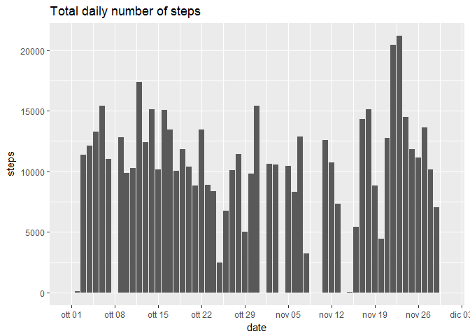
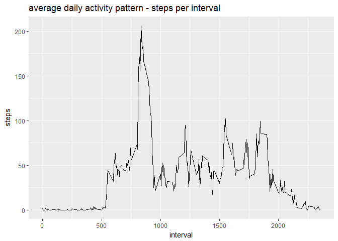
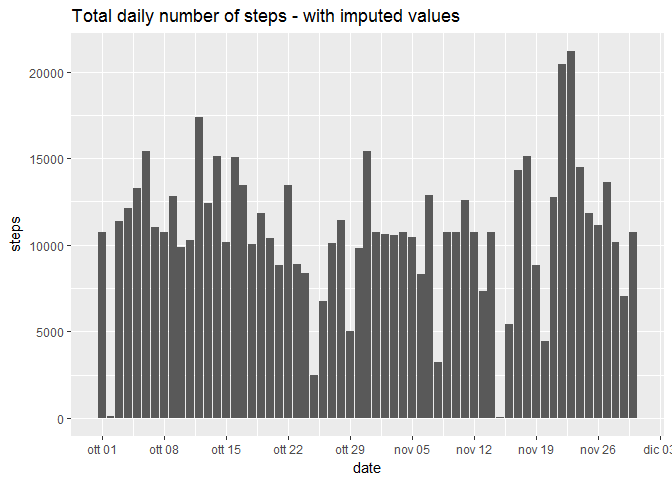
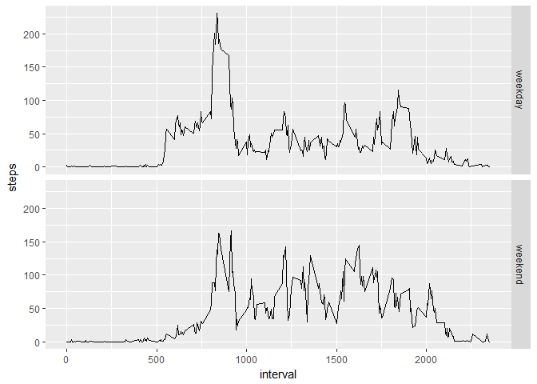

# Reproducible Research: Peer Assessment 1


## Loading and preprocessing the data

First load libraries

```r
library(scales)
library(ggplot2)
library(knitr)
```

Then loading data and converting date , with data summary

```r
unzip("./activity.zip")
activities <- read.csv("./activity.csv")

# cast character date into Date
activities$date <- as.Date (activities$date,"%Y-%m-%d")
summary(activities)
```

```
##      steps             date               interval     
##  Min.   :  0.00   Min.   :2012-10-01   Min.   :   0.0  
##  1st Qu.:  0.00   1st Qu.:2012-10-16   1st Qu.: 588.8  
##  Median :  0.00   Median :2012-10-31   Median :1177.5  
##  Mean   : 37.38   Mean   :2012-10-31   Mean   :1177.5  
##  3rd Qu.: 12.00   3rd Qu.:2012-11-15   3rd Qu.:1766.2  
##  Max.   :806.00   Max.   :2012-11-30   Max.   :2355.0  
##  NA's   :2304
```


## What is mean total number of steps taken per day?

* Calculate the total number of steps taken per day

```r
daysteps <- setNames(aggregate(activities$steps,by=list(activities$date),sum,na.rm=T),c("date","steps"))
```

*  Make a histogram of the total number of steps taken each day

```r
gg <- ggplot(data = daysteps, aes(x=date,y=steps)) + geom_bar(stat = 'identity') + scale_x_date(date_breaks = '1 week',date_labels = "%b %d") + labs(title = "Total daily number of steps ")
print(gg)
```

<!-- -->


* Calculate and report the mean and median of the total number of steps taken per day

```r
mea <- mean(daysteps$steps)
med <- median( daysteps$steps)
```
The mean and median of the total number of steps taken per day are respectively **9354.23** and **10395**.

## What is the average daily activity pattern?


```r
dayintervals <- aggregate(steps ~ interval, mean, data=activities, na.rm=T)

gg <- ggplot(data = dayintervals, aes(x=interval,y=steps)) + geom_line() + labs(title = "average daily activity pattern - steps per interval")
print(gg)
```

<!-- -->


```r
m <- subset(dayintervals,steps==max(dayintervals$steps))
```
The 5-minute interval which, on average across all the days in the dataset, contains the maximum number of steps is the number **835**, with an average of **206.1698** steps.

## Imputing missing values
Since there are a number of days/intervals where there are missing values (coded as NA), they  may introduce bias into some calculations or summaries of the data.

* Calculate and report the total number of missing values in the dataset (i.e. the total number of rows with NAs)

```r
totNA <- sum(is.na(activities$steps))
```
The total number of observations with missing values is **2304**.

* Create a new dataset that is equal to the original dataset but with the missing data filled in.

```r
activitiesNoNA <- read.csv("./activity.csv")
activitiesNoNA$date <- as.Date (activitiesNoNA$date,"%Y-%m-%d")

# Devising a strategy for filling in all of the missing values in the dataset,
# i used the mean for that 5-minute interval.
for(i in seq_along(activitiesNoNA$steps)){
  if(is.na(activitiesNoNA$steps[i])){
    activitiesNoNA$steps[i] <- subset(dayintervals,interval==activitiesNoNA$interval[i])[,2]
  }
}
```

* Make a histogram of the total number of steps taken each day. 


```r
daystepsNoNA <- aggregate(steps ~ date, sum, data=activitiesNoNA, na.rm=T)
gg <- ggplot(data = daystepsNoNA, aes(x=date,y=steps)) + geom_bar(stat = 'identity') + scale_x_date(date_breaks = '1 week',date_labels = "%b %d") + labs(title = "Total daily number of steps - with imputed values")
print(gg)
```

<!-- -->

* Calculate and report the mean and median total number of steps taken per day

```r
meaNoNA <- mean(daystepsNoNA$steps)
medNoNA <- median( daystepsNoNA$steps)
```
The mean and median of the total number of steps taken per day after imputed missing values are respectively **10766.19** and **10766.19**.

* Do these values differ from the estimates from the first part of the assignment?  
The values differ from the first part of assignment respectively: mean by **1411.959** and median by **371.1887**.


* What is the impact of imputing missing data on the estimates of the total daily number of steps?

```r
df <-setNames(cbind(daysteps,daystepsNoNA$steps),c("date","stepswNA","stepswoNA")) 

kable(subset(df,(stepswoNA-stepswNA)>0),caption="Days impacted by imputing missing data",col.names = c("date","total steps with NA","total steps after imputing missing data")) 
```


Table: Days impacted by imputing missing data

     date          total steps with NA   total steps after imputing missing data
---  -----------  --------------------  ----------------------------------------
1    2012-10-01                      0                                  10766.19
8    2012-10-08                      0                                  10766.19
32   2012-11-01                      0                                  10766.19
35   2012-11-04                      0                                  10766.19
40   2012-11-09                      0                                  10766.19
41   2012-11-10                      0                                  10766.19
45   2012-11-14                      0                                  10766.19
61   2012-11-30                      0                                  10766.19

## Are there differences in activity patterns between weekdays and weekends?

Use the dataset with the filled-in missing values for this part.

* Create a new factor variable in the dataset with two levels - "weekday" and "weekend" indicating whether a given date is a weekday or weekend day.


```r
activitiesNoNA$daytype <- factor(ifelse(as.POSIXlt(activitiesNoNA$date)$wday %in% c(0,6),"weekend","weekday"))
```

* Make a panel plot containing a time series plot (i.e. type = "l") of the 5-minute interval (x-axis) and the average number of steps taken, averaged across all weekday days or weekend days (y-axis). 


```r
datedf <- aggregate(steps ~  interval + daytype , FUN = mean, data=activitiesNoNA)
gg <- ggplot(data=datedf, aes(x=interval,y=steps))+geom_line()+ facet_grid(daytype~.)
print(gg)
```

<!-- -->
